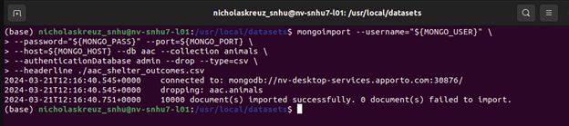
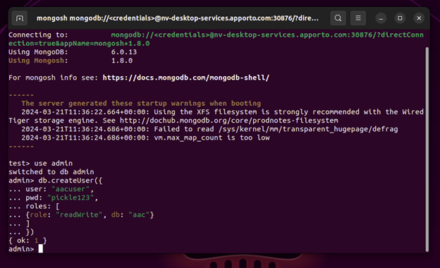
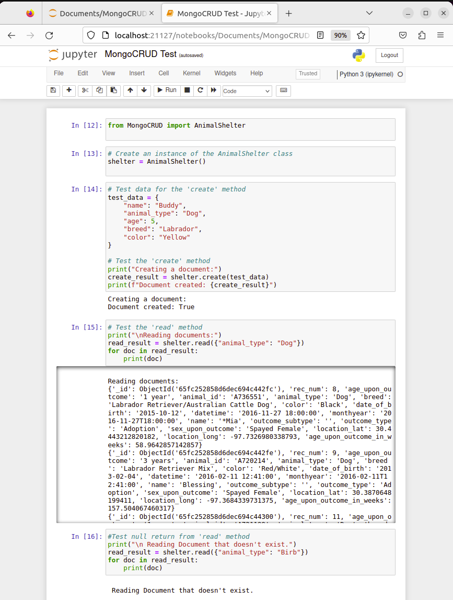
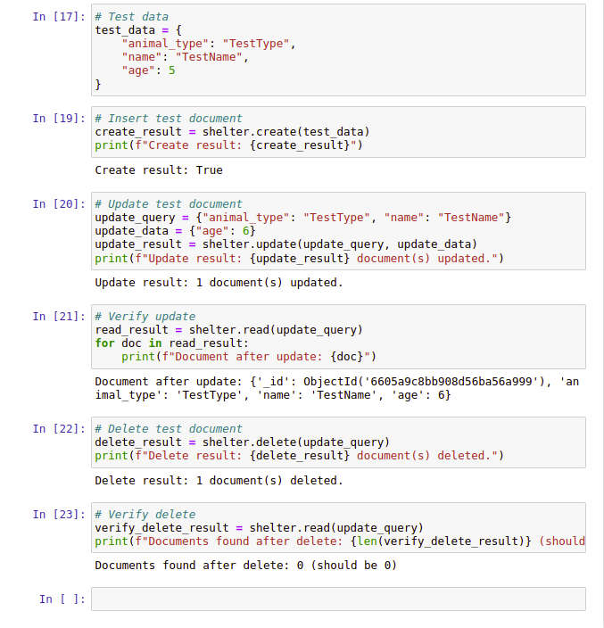
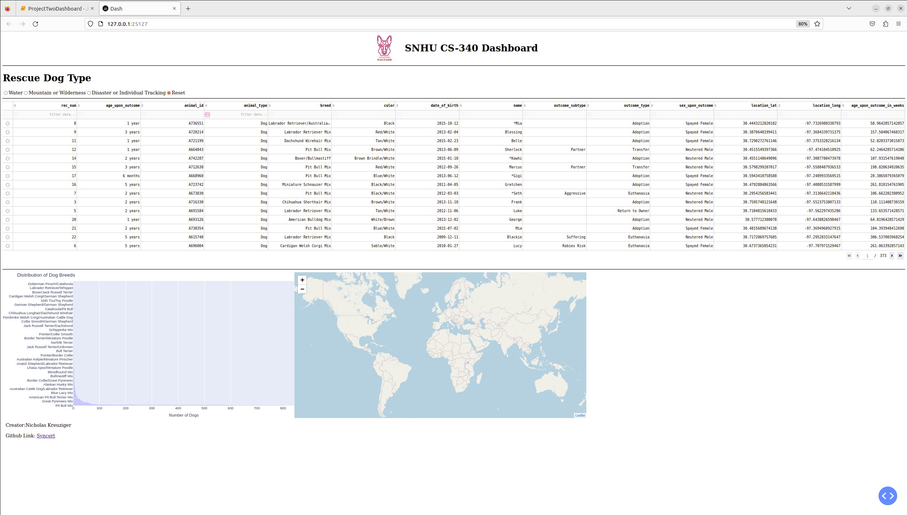
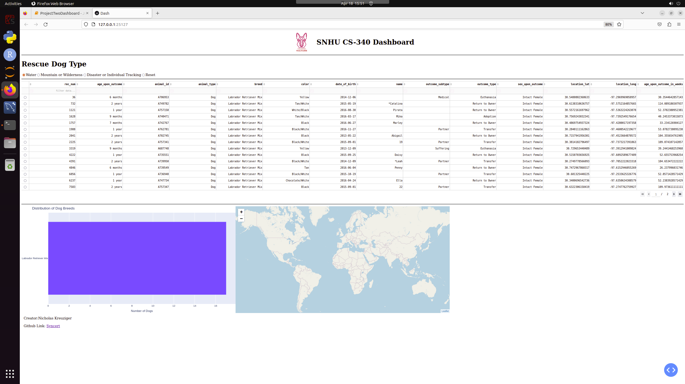
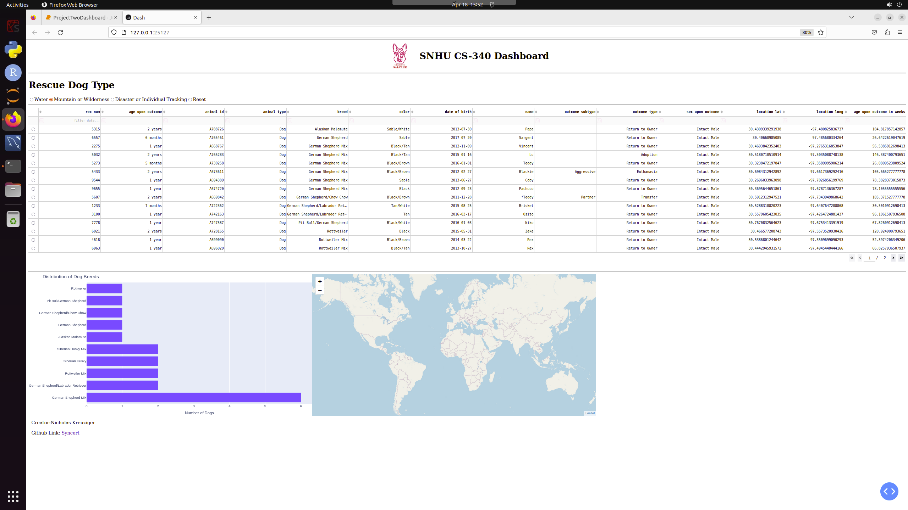
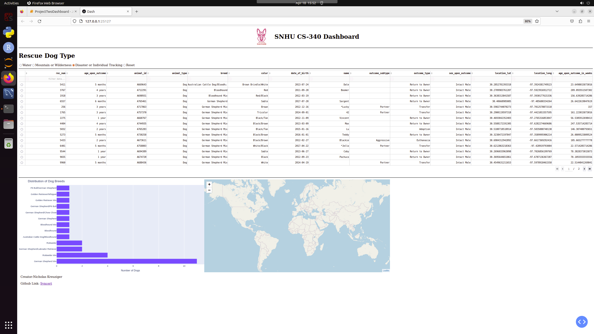

**Scenario** 
You work for Global Rain, a software engineering company that specializes in custom software design and development. Your team has been assigned to work on a project for an innovative international rescue-animal training company, Grazioso Salvare. You have been made the lead developer on this project.

Grazioso Salvare identifies dogs that are good candidates for search-and-rescue training. When trained, these dogs can find and help to rescue humans or other animals, often in life-threatening conditions. To help identify dogs for training, Grazioso Salvare has reached an agreement with a nonprofit agency that operates five animal shelters in the region around Austin, Texas. This nonprofit agency will provide Grazioso Salvare with data from their shelters.

You meet with the client, Grazioso Salvare, and discover that they look for certain profiles in dogs to train. For instance, search-and-rescue training is generally more effective for dogs no more than two years old. Also, certain breeds of dogs are proficient at different types of rescue, such as water rescue, mountain or wilderness rescue, locating humans after a disaster, or finding a specific human by tracking their scent.

Grazioso Salvare is seeking a software application that can work with existing data from the animal shelters to identify and categorize available dogs. Global Rain has contracted for a full stack development of this application that will include a database and a client-facing web application dashboard. Users at Grazioso Salvare will access the database. The full stack development will be fully completed in Projects One and Two.

Grazioso Salvare has also requested that the code for this project be open source and accessible on GitHub so similar organizations may use and adapt it. They have asked that you also create a README file to accompany your work.

In Project One, you will complete the first phase of this development by creating a database in MongoDB that can interact with client-side code. You will also create an initial README file to accompany your code. In Project Two, later in this course, you will complete the second phase of development by updating the database, producing the dashboard, and updating the README file to explain the full stack development.

**Project One** 
*This Project was focused on the backend development of the web application*
We were required to create a separate user account with read write access to only the database of concern. Additionally, we were to create a module that has CRUD functionality utilizing this new user account. This allows read/write access to only the data related to the project.

I uploaded the dataset using the mongoimport tool. This demonstrates the ability to upload a .csv dataset into a mongoDB instance.

I created a user account that only has read/write access to the database of concern. This enforces secure development practices.

I created a Module in Python that accesses the MongoDB Animal Collection and successfully Creates/Reads/Updates/Deletes records in the MongoDB collection. 

**Project Two** 
*This project was focused on the frontend development of the web application*
We were required to create an interactive dashboard for the stakeholders that allowed for navigation of the Shelter Data and Geolocation features on a map widget. Additionally we were to provide a secondary graphic that gives an insight to the distribution of breeds filtered. There were 3 different Rescue Functions, Water, Mountain Rescue and Disaster Rescue. Each of these different Rescue Types had different Breed , Sex and Age Requirements to be adopted into the program.

<video width="320" height="240" controls>
  <source src="Resources/Project_Two_Functionality_Recording.mkv" type="video/x-matroska">
  Your browser does not support the video tag.
</video>

Landing Page

Filtered to Water Rescue

Filtered to Mountain and Disaster Rescue

Filtered to 

**Getting Started** 
*If you'd like to install and run a copy of this MongoDB CRUD Module, detailed instructions are present in the README_MongoCRUD.docx file*

